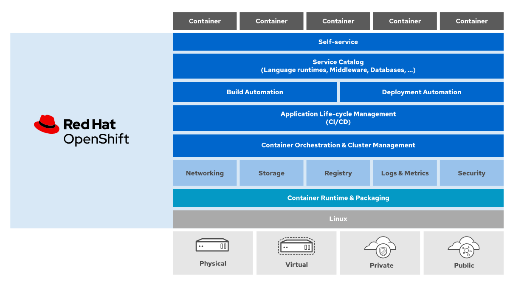
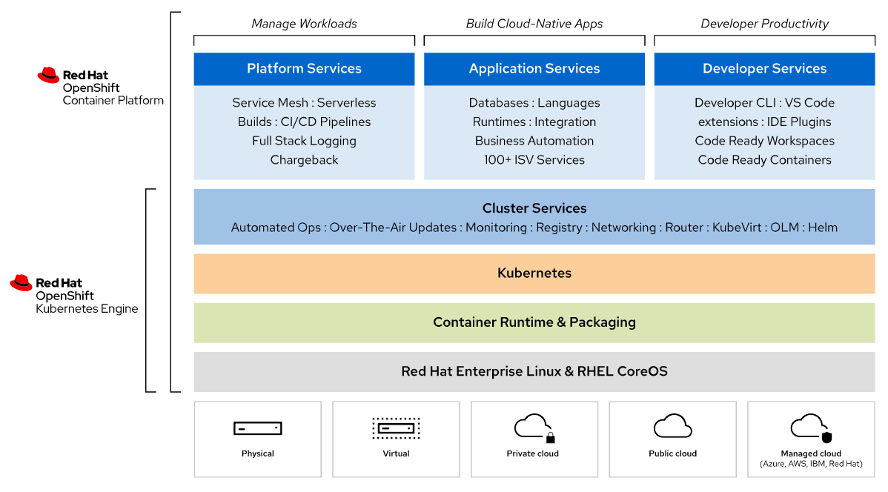

 

    

 
 
 

# 1. What is Red Hat OpenShift?

## 1.1. Introduction

Red Hat OpenShift Container Platform is an Enterprise Product focused on IT operations and cloud-native applications development. OpenShift is based on an optimized Kubernetes distribution called [OKD](https://www.okd.io/) that adds developer and operations-centric tools on top of Kubernetes to enable rapid application development, easy deployment and scaling, and long-term lifecycle maintenance for small and large teams. OKD is free to use and has the core features of OpenShift, but without the enterprise support that comes with the paid Red Hat OpenShift subscription. OpenShift, like OKD and Kubernetes, is also completely open-source. You can see the code for yourself at [GitHub](https://github.com/openshift/). Red Hat OpenShift is named a leader across 29 criteria and 8 major vendors by the [Q3 2020 Forrester Wave report](https://www.openshift.com/2020-forrester-wave?hsLang=en-us).

In the image below you can see all the resources and services provided by the OpenShift Container Platform:

 

    

 

Some products and components that are part of the OpenShift Container Platform:

- Red Hat Enterprise Linux CoreOS

- CRI-O Container Engine

- Kubernetes (OKD)

- Self-service Web Console

- Internal Container Registry with pre-installed applications and monitoring tools

- Certified container images for several programming languages, databases and other software packages

## 1.2. OpenShift Kubernetes Engine vs OpenShift Container Platform

OpenShift offers multiple resources to automate, scale and manage containerized applications. A lot of these resources are enabled by Kubernetes. In the image below, you can see the differences between the Red Hat OpenShift **Container Platform** and the Red Hat OpenShift **Kubernetes Engine**:

 

    

 

# 1.3. Main differences from Kubernetes

The main difference from Kubernetes is that OpenShift is a full fledged product with enterprise support that requires a paid subscription, while Kubernetes is simply an open-source project.

OpenShift runs on top of the Red Hat Enterprise Linux CoreOS operating system, and instead of Docker it uses the lightweight CRI-O container engine optimized for OKD. OKD, like most Kubernetes distributions, also uses ETCD for key-value pair storage. You can check [more details about the OCP architecture at the official Red Hat documentation](https://access.redhat.com/documentation/en-us/openshift_container_platform/4.5/html/architecture/architecture-rhcos).

OpenShift also has an ebedded security layer based on SELinux, that disallows the execution of containers as root users—which is one of the main vulnerabilities in containerized applications. OpenShift brings authentication and authorization resources into its object model which Kubernetes currently don't have. In general, OpenShift has a "secure-by-default" policy tailored for Enterprise applications.

Besides security and usability, OpenShift is heavily gueared to a DevOps culture, supporting native container image management with the use of an internal Container Image Registry and Image Streams—another type of resource in the OpenShift object model.

>"As a catch-all container platform, Red Hat OpenShift is more than a software product. It can be the key to adopting a DevOps culture, automating routine operational tasks and standardizing environments across an app’s life cycle." — Red Hat

# 1.3. Where can you use it?

Red Hat OpenShift clusters can be "managed" or "self-managed". Managed cluster's compute and network infrastructures are hosted and managed by cloud providers while self-managed clusters needs to be installed from scratch - they can be installed on traditional cloud infrastructure nevertheless. OpenShift is a multicloud offering available at IBM Cloud, Azure, AWS and Google Cloud. A full list of supported cloud providers which have managed OpenShift offerings can be viewed [at the official OpenShift homepage](https://www.openshift.com/products/pricing/).

OpenShift clusters have a monthly license cost attached, while the compute and network infrastructure costs are paid to a specific cloud provider, and vary depending on the allocated resources and specific provider's price plans for infrastructure.

[Go to Summary](../README.md)

[Go to Chapter 2: OpenShift Architecture](./2-openshift-architecture.md)