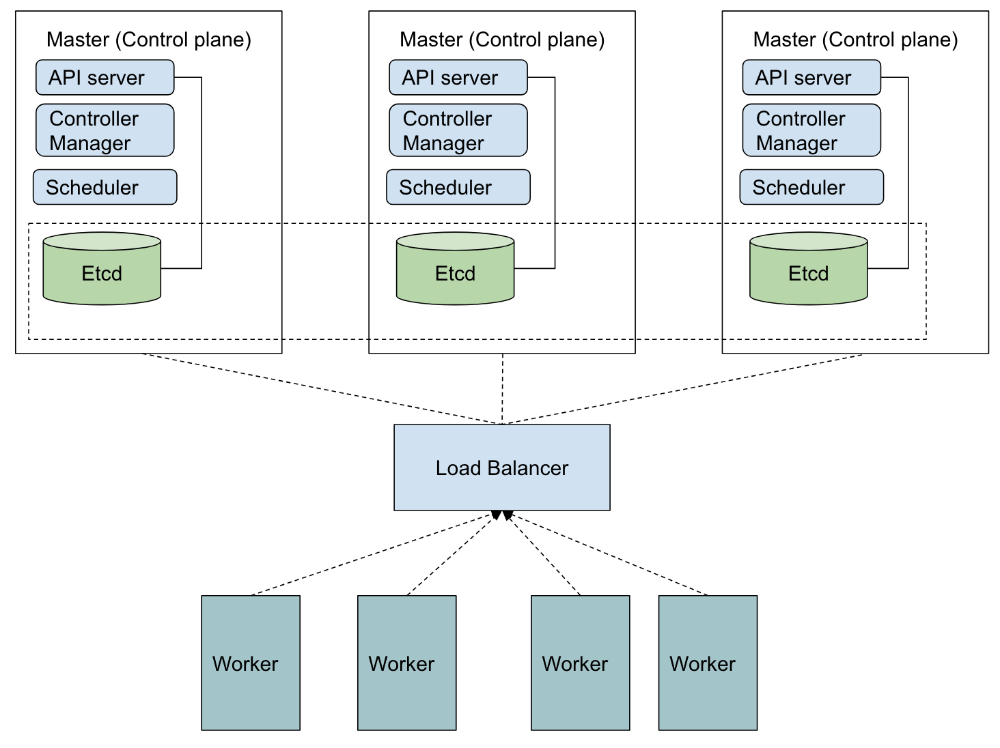

 

    

 
 
 

# 2. OpenShift Architecture

## 2.1. The declarative state model

OpenShift architecture is based on the declarative nature of Kubernetes. In a declarative architecture, you define the desired system state and OpenShift makes sure to apply the desired changes, or restore the state if some unexpected change occurs. As with Kubernetes, in OpenShift you can declare a Pod resource defining a container to be executed under specific conditions. Then, OpenShift searches for a Worker Node able to execute this container under these previously defined specific conditions. 

Declarative architectures enable easier management of auto-optimized and self-healing systems, in contrast to imperative architectures. OpenShift defines the cluster state, including all sets of deployed applications, as a set of **resources** stored in an Etcd database. OpenShift also has controllers that monitor and compare the current cluster state with the desired state stored at Etcd. The controllers also execute any action required to reconcile the current state with the desired state.

Kubernetes, as well as OpenShift, provides a REST API for managing these **resources** that define the cluster state. All actions executed by the user using the OpenShift command-line client (the `oc` tool, or even the `kubectl` tool), are executing API requests to the OpenShift REST API.

## 2.2. Cluster nodes

Kubernetes was designed for high availability, not only for the user applications but also for its internal components. OpenShift is built on top of this concept and the basic underlying components follow basically the same structure. Nodes in the cluster are divided into **worker nodes** and **control nodes**. Both types of nodes are replicated for high availability. A control node can also be a worker node, but these roles are usually segregated for improved system stability.

 

    

 

## 2.3. The Control Plane

Each **worker node** contains a *kubelet* system and a container engine running (OpenShift exclusively uses CRI-O as a container engine). The **control nodes** execute the OpenShift REST API Server, replicas of the Etcd database and the controllers that act upon the cluster resources.

Depending on the type of node, the *kubelet* agent can start static pods (that do not require connection with the API server to initialize). Static pods provide services for the control plane, such as the OpenShift scheduler, and the software-defined network (SDN) for the OpenShift cluster.

## 2.4. OpenShift extensions

[Go to Chapter 1: What is Red Hat OpenShift?](./1-what-is-openshift.md)

[Go to Chapter 3: Red Hat OpenShift Kubernetes Service (ROKS) at IBM Cloud](./3-roks-at-ibm-cloud.md)