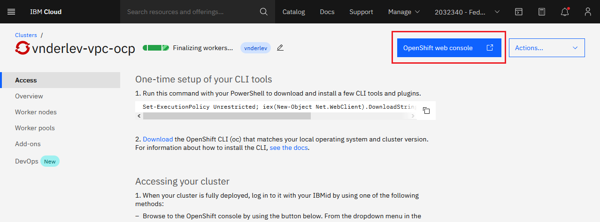

 

    

 
 
 

# 2. Red Hat OpenShift Kubernetes Service (ROKS) at IBM Cloud

## 2.1. Multicloud Red Hat OpenShift offerings

Red Hat OpenShift clusters can be "managed" or "self-managed". Managed cluster's compute and network infrastructures are hosted and managed by cloud providers while self-managed clusters need to be installed from scratch - they can be installed on traditional cloud infrastructure nevertheless. A full list of supported cloud providers which have managed OpenShift offerings can be viewed [at the official OpenShift homepage](https://www.openshift.com/products/pricing/).

OpenShift clusters have a Red Hat monthly license cost attached, while the compute and network infrastructure costs are paid to a specific cloud provider and vary depending on the allocated resources and specific provider's price plans.

## 2.2. Creating a managed OpenShift cluster at IBM Cloud

There are two types of managed OpenShift clusters "as a Service" at IBM Cloud: a cluster created with classic infrastructure, or one created with a Virtual Private Cloud (VPC) infrastructure. VPC clusters have a virtual network layer built on top of the Virtual Servers Instances (VSI's). This network layer provides isolation and improved personalization capabilities such as custom network security policies for the subjacent compute infrastructure. VPC infrastructure is not yet available at South America.

- [Provision a Virtual Private Cloud](https://cloud.ibm.com/vpc/provision/vpc) (Optional)
- [Provision a managed OpenShift cluster](https://cloud.ibm.com/kubernetes/catalog/create?platformType=openshift)

When provisioning the OpenShift cluster at IBM Cloud, you'll setup the following:

- OpenShift version (3.11, 4.4, or 4.5)
- Purchase of additional OCP licenses or application of an existing Cloud Pak OCP entitlement license
- Infrastructure type: Classic, VPC, or Satellite (new)
- Location (AZs and subnets)
- Worker Pool (vCPUs, Memory, nº of worker nodes)

### 2.2.1. Details for VPC clusters

1. If you choose to create a VPC cluster you need to have at least three subnets (one in each AZ).
2. Each subnet must have a Public Gateway attached, otherwise you won't be able to access your cluster through the Internet.
3. If you check your Load Balancers at the [IBM Cloud VPC panel](https://cloud.ibm.com/vpc-ext/network/loadBalancers) you will see that OpenShift creates one automatically for you.

## 2.3. Accessing your cluster

Access the [IBM Cloud Resources List](https://cloud.ibm.com/resources) and click on the previously created cluster. You'll be redirected to the managed cluster administration page at IBM Cloud, where you can check access, overview worker node's status, create new worker pools, install add-ons and attach IBM DevOps solutions to your cluster.

To access the OpenShift Web Console you can simply click on the blue button, as indicated on the image below.

 

    

 

[Go to Chapter 1: What is Red Hat OpenShift?](./1-what-is-openshift.md)

[Go to Chapter 3: Environment Setup](./3-environment-setup.md)