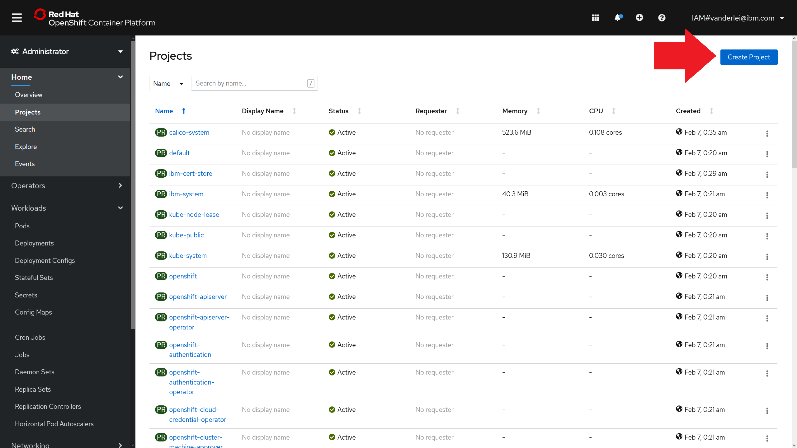
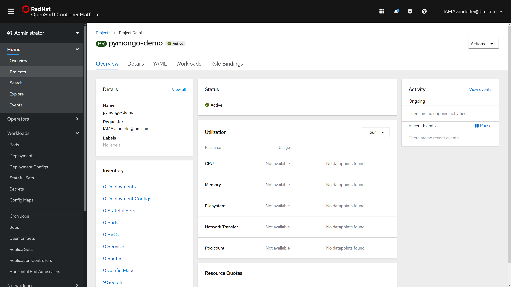
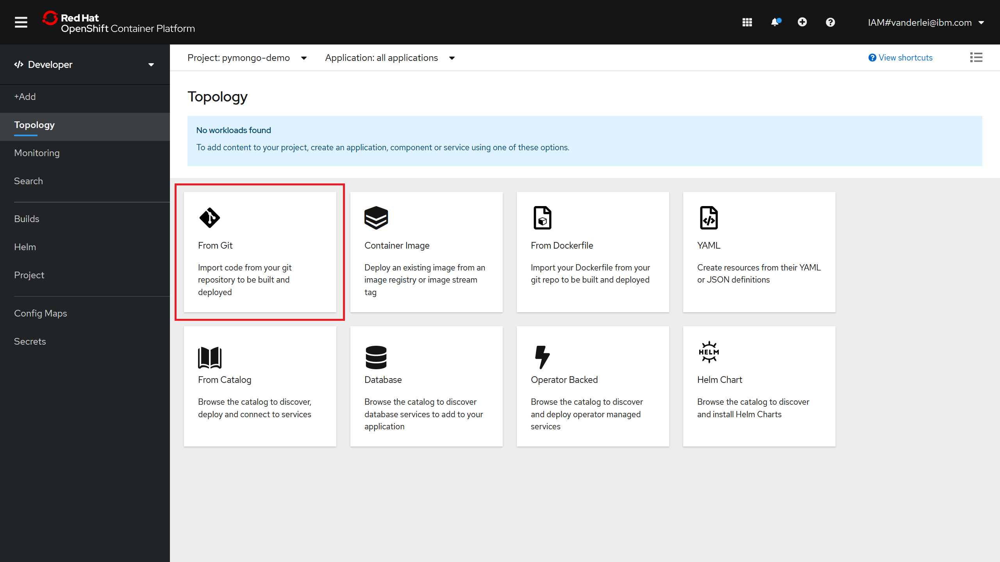
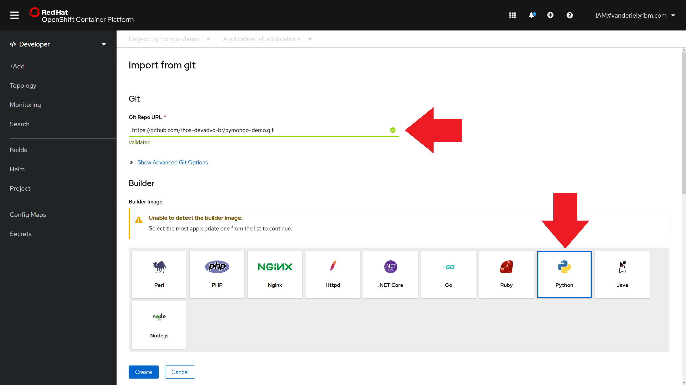
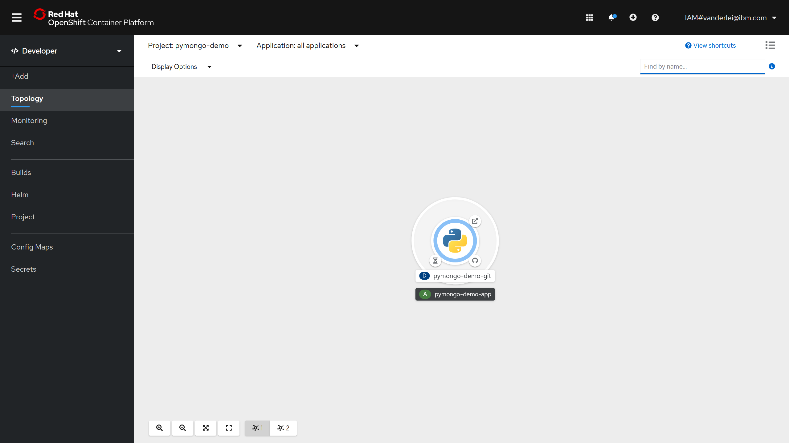
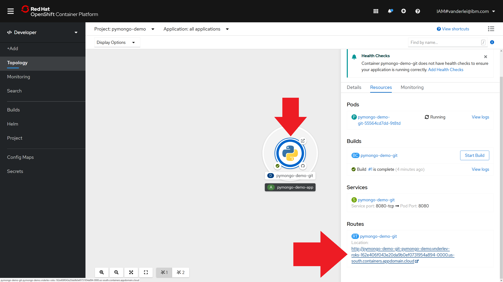

<br>
<div align="center">
    <a href="../README.md">
        
    </a>
</div>
<br>
<br>
<br>

# LAB 1: Creating an OpenShift Project and deploying an application from the Web Console

## 1. Introduction

In this lab you will learn how to create a Project in OpenShift using the *oc* tool as well using the web console. This lab uses a very simple Python application to demonstrate core OpenShift features. The Python application source-code can be found in the [pymongo-demo repository](https://github.com/rhos-devadvo-br/pymongo-demo) and is based on the Flask web micro-framework, Jinja and the PyMongo interface.

## 2. Using the OpenShift CLI

### 2.1. Creating a Project

To create a project using the oc tool, just execute the "new-project" instruction:

```bash
oc new-project pymongo-demo
```

### 2.2. Creating an Application

Then create a new application inside the project using the "new-app" instruction:

```bash
oc new-app 'https://github.com/rhos-devadvo-br/pymongo-demo.git' --name=web
```

Note: the new-app instruction create a Deployment, if you desire to create a DeploymentConfig pass the --as-deployment-config flag.

OpenShift automatically detect that this is a Python application and then fetch the tailored Python base image maintained by Red Hat. If you want to use the custom Dockerfile provided in the source code, you need to pass the "--strategy=docker" parameter to the *new-app* instruction.

The output of the new-app command should be similar to:

```bash
--> Found image a47e9ad (4 months old) in image stream "openshift/python" under tag "3.6" for "python"

    Python 3.6 
    ---------- 
    Python 3.6 available as container is a base platform for building and running various Python 3.6 applications and frameworks. Python is an easy to learn, powerful programming language. It has efficient high-level data structures and a simple but effective approach to object-oriented programming. Python's elegant syntax and dynamic typing, together with its interpreted nature, make it an ideal language for scripting and rapid application development in many areas on most platforms.

    Tags: builder, python, python36, python-36, rh-python36

    * The source repository appears to match: python
    * A source build using source code from https://github.com/rhos-devadvo-br/pymongo-demo.git will be created
      * The resulting image will be pushed to image stream tag "web:latest"
      * Use 'oc start-build' to trigger a new build

--> Creating resources ...
    imagestream.image.openshift.io "web" created
    buildconfig.build.openshift.io "web" created
    deployment.apps "web" created
    service "web" created
--> Success
    Build scheduled, use 'oc logs -f bc/web' to track its progress.
    Application is not exposed. You can expose services to the outside world by executing one or more of the commands below:
     'oc expose svc/web' 
    Run 'oc status' to view your app.
```

You can check the logs of the Build process in real-time using the logs command:

```bash
oc logs -f bc/web
```

### 2.3. Exposing a public Route for the App

To expose the created application so it can be accessed through the Internet you need to use the "expose" instruction on an existing Service object. A Service OpenShift object was previously created automatically by the "new-app" instruction, you can create a new route and attach the existing Service running the following command:

```bash
oc expose service/web
```

After exposing the Service, you can execute "get routes" to check the automatically generated address for accessing your Python application.

```bash
oc get routes
```

The output should be similar to:

```bash
NAME   HOST/PORT                                                                                                     PATH   SERVICES   PORT       TERMINATION   WILDCARD
web    web-pymongo-demo-oc.vnderlev-roks-162e406f043e20da9b0ef0731954a894-0000.us-south.containers.appdomain.cloud          web        8080-tcp                 None
```

Simply copy the HOST/PORT value of the created route and paste on a browser. You'll see the running python App!

## 3. Using the OpenShift Web Console

### 3.1. Creating a Project

Access the OpenShift web console and on the Administrator panel, navigate through "Home -> Projects" and click on "Create Project", as indicated on the image below.

<br>
<div align="center">
    
</div>
<br>

You will be prompted for a Project name, display name (optional) and description (optional). Choose a name for your project and click on Create. You'll be redirected to the Project Details page, shown below. Note that the project name is "pymongo-demo".

<br>
<div align="center">
    
</div>
<br>

### 3.2. Creating an Application

To create an Application, access the Developer panel and then navigate to the Topology tab. A message saying "No workloads found" will appear for the recently created empty Project. You can choose from several deployment options:

- From Git
- Container Image
- From Dockerfile
- YAML
- From Catalog
- Database
- Operator Backed
- Helm Chart

Click on the "From Git" option, as indicated in the image below.

<br>
<div align="center">
    
</div>
<br>

You'll be redirected to the App creation form. Copy the pymongo-demo application repository ('https://github.com/rhos-devadvo-br/pymongo-demo.git') into the Git Repo URL field and then select the Python 3.6 Builder Image, as indicated in the image below.

<br>
<div align="center">
    
</div>
<br>

Left the other fields such as "Application Name" with the default values and then click on the "Create" button. You'll now be able to see the created Python application in the Topology canvas.

<br>
<div align="center">
    
</div>
<br>

Click on the Python application and then scroll down the right-side panel until you see the "Routes" information. Click on the generated URL to access the deployed application.

<br>
<div align="center">
    
</div>
<br>

## 4. The deployed pymongo-demo Application

The deployed application is a simple web page that show saved notes written in a MongoDB instance. Because we just deployed the web application and not the database yet, you'll be greeted by a red warning saying "Ops! We don't have a database?"

<br>
<div align="center">
    
</div>
<br>

<hr>

[Go to LAB 2: Scaling pods and adding a self-healing database layer with a Template](./lab-2.md)
