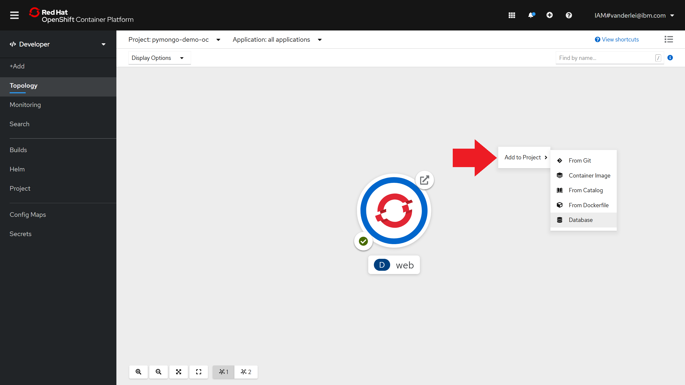
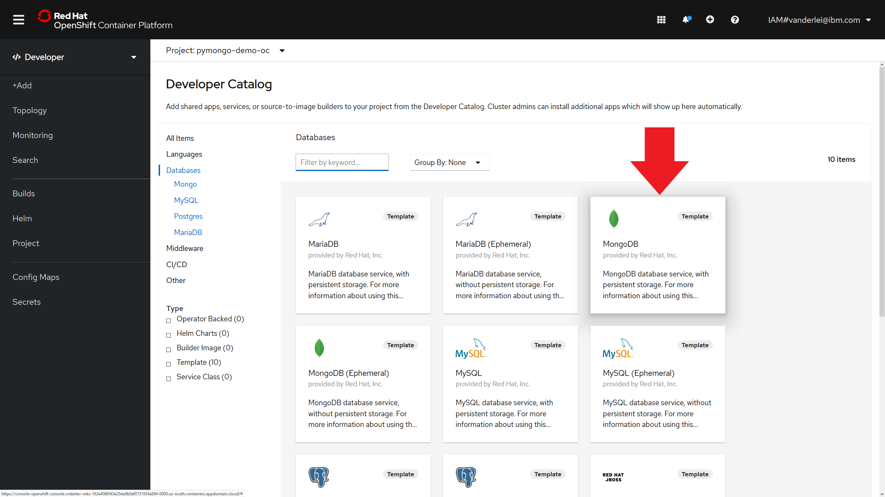
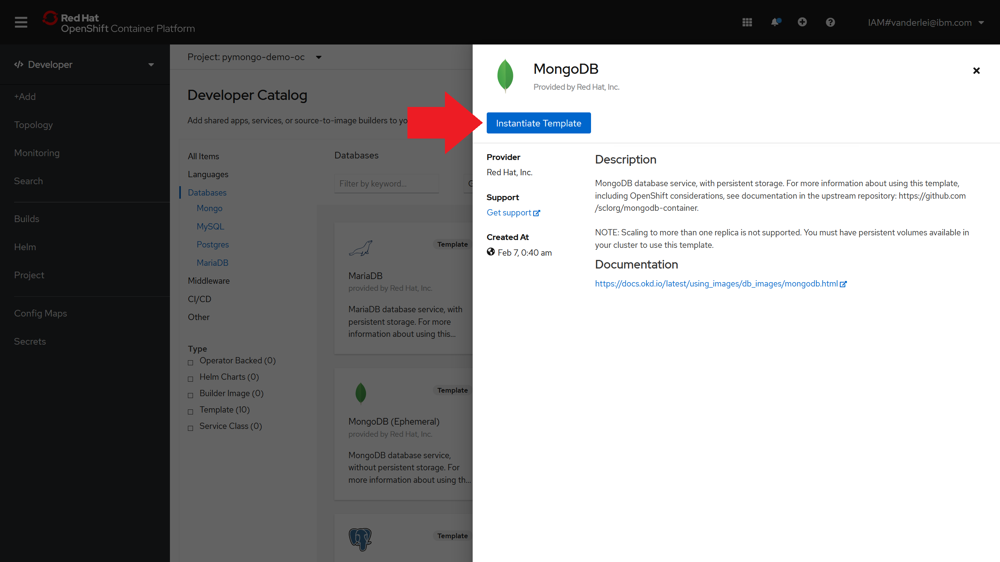
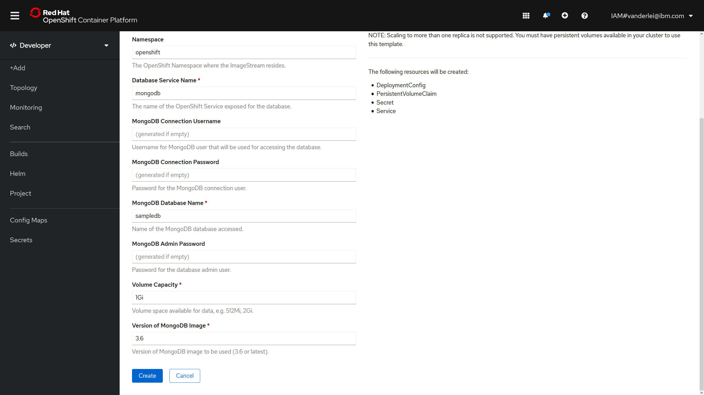
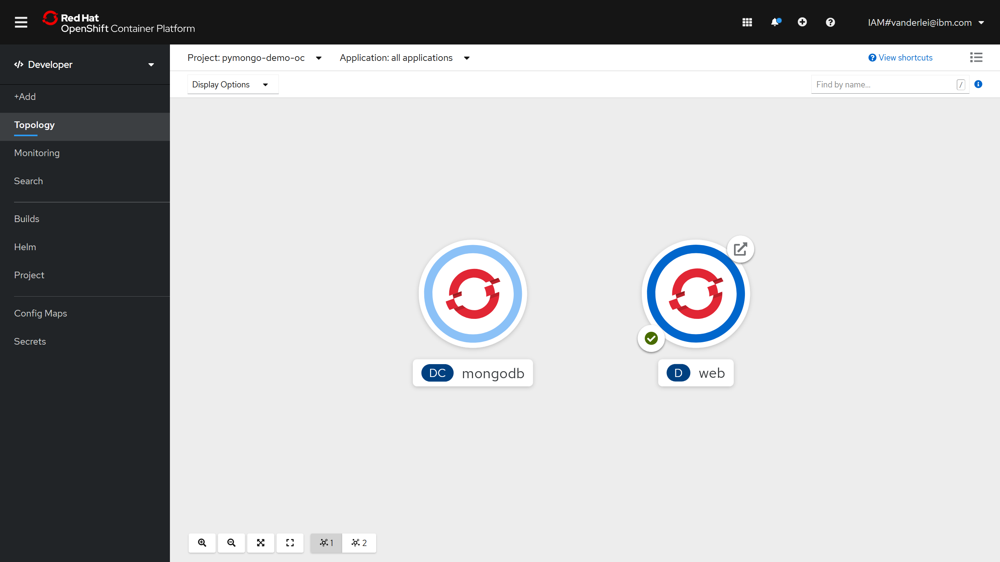

<br>
<div align="center">
    <a href="../README.md">
        
    </a>
</div>
<br>
<br>
<br>

# LAB 2: Scaling pods and adding a self-healing database layer with a Template

## 1. Introduction

In this lab you will continue building the application from [Lab 1](./lab-1.md), scaling the number of replicas and adding a Mongo NoSQL database into our Project.

## 2. Scaling Deployments

### 2.1. Using the OpenShift CLI

Using the OpenShift CLI we can scale Deployments or DeploymentConfigs using the "scale" instruction and passing the number of desired replidas, as shown below.

```bash
oc scale deployment web --replicas=2
```

The OpenShift controller will now make sure we have two replicas of the "web" Deployment. You can easily check the new number of pods running with the instruction "get pods".

```bash
╭─vnderlev@AMD3900XT ~/openshift 
╰─$ oc get pods
NAME                   READY   STATUS      RESTARTS   AGE
web-1-build            0/1     Completed   0          15h
web-5bf97f5cf9-fvzzv   1/1     Running     0          15h
web-5bf97f5cf9-gl5qq   1/1     Running     0          7s
```

### 2.2. Using the OpenShift Web Console

To scale deployments using the Web Console you can simply right-click the desired Deployment and select "Edit Pod Count". You then be prompted to input the desired number of replicas.

<br>
<div align="center">
    
</div>
<br>

You can also scale Deployments and DeploymentConfigs from the Administrator panel on the "Workloads -> Deployments" or "Workloads -> DeploymentConfigs" tabs.

## 3. Deploying a Mongo database using a Red Hat Template

To deploy a database from a Red Hat Template you can right-click on the Topology canvas and select "Add to Project -> Database", as shown below.

<br>
<div align="center">
    
</div>
<br>

Select the "MongoDB template". 

Note: the "MongoDB (Ephemeral)" is the same MongoDB but without persistent storage (no PVC will be created).

<br>
<div align="center">
    
</div>
<br>

After selecting the MongoDB Template, click on "Instantiate Template", as indicated below.

<br>
<div align="center">
    
</div>
<br>

You'll now be prompted to review some information about the objects that will be created by the OpenShift Template, such as:

- Namespace (default=\<name of current Project\>)
- Memory Limit (default=512Mi)
- Namespace (default=openshift)
- Database Service Name (default=mongodb)
- MongoDB Connection Username (generated if empty)
- MongoDB Connection Password (generated if empty)
- MongoDB Database Name (default=sampledb)
- MonboDB Admin Password (generated if empty)
- Volume Capacity (default=1Gi)
- Version of MongoDB Image (3.6 or latest)

You can left all the values as default, and click on create at the end of the form.

<br>
<div align="center">
    
</div>
<br>

After creating the persistent MongoDB, you'll be redirected to the Topology canvas where it will be possible to see two applications, the "web" Deployment and the "mongodb" DeploymentConfig.

<br>
<div align="center">
    
</div>
<br>

We can use the OpenShift CLI to check the creation of the new pods and the Persitent Volume Claim (PVC) for the database.

```bash
╭─vnderlev@AMD3900XT ~/openshift 
╰─$ oc get pvc                             
NAME      STATUS   VOLUME                                     CAPACITY   ACCESS MODES   STORAGECLASS      AGE
mongodb   Bound    pvc-fb468d44-c2e6-4f4d-8f26-219e87356a1d   20Gi       RWO            ibmc-block-gold   71m
```

```bash
╭─vnderlev@AMD3900XT ~/openshift 
╰─$ oc get pods 
NAME                   READY   STATUS      RESTARTS   AGE
mongodb-1-deploy       0/1     Completed   0          3m51s
mongodb-1-mb9ng        1/1     Running     0          3m50s
web-1-build            0/1     Completed   0          16h
web-5bf97f5cf9-fvzzv   1/1     Running     0          16h
web-5bf97f5cf9-gl5qq   1/1     Running     0          62m
```

## 4. Updating the "web" Deployment environment variables with a Secret

The Flask application code is currently looking for the MongoDB credentials in environment variables that are not set. To set the credentials we will transport the "mongodb" secret created by the MongoDB Red Hat Template into the "web" deployment with the set instruction:

```bash
oc set env --from=secret/mongodb deployment/web
```

After executing the command above, all pods in the "web" Deployment will be re-created with the new environment variables configured. If we visit the application Route again we'll see that the error warning about the inexistent database doesn't appear anymore.

<br>
<div align="center">
    
</div>
<br>


<hr>

[Go to LAB 1: Creating an OpenShift Project and deploying a web application](./lab-1.md)

[Go to LAB 3: DevOps with OpenShift source-to-image (s2i) and GitHub webhooks](./lab-3.md)