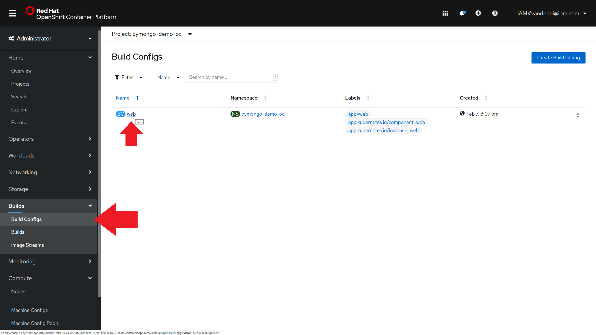
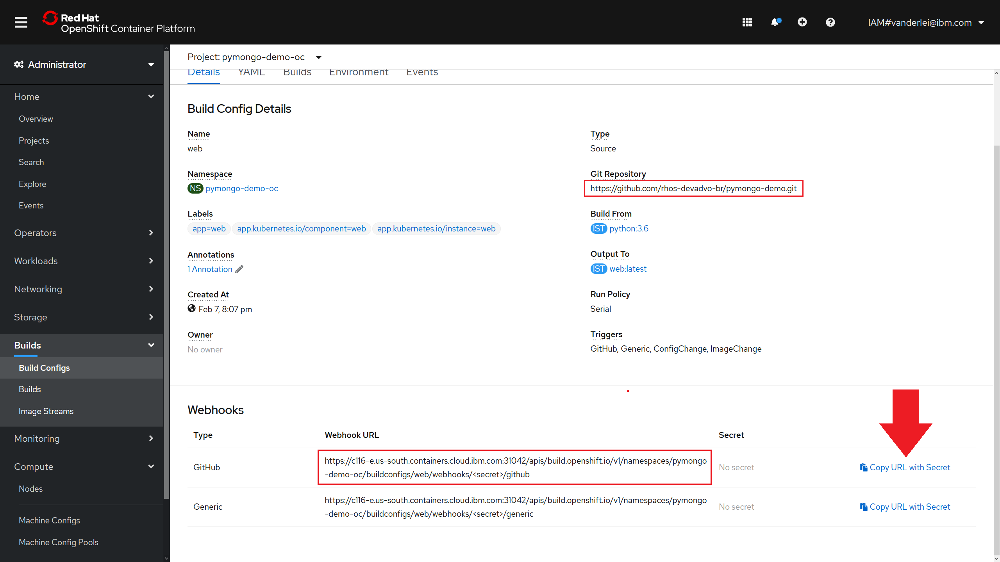
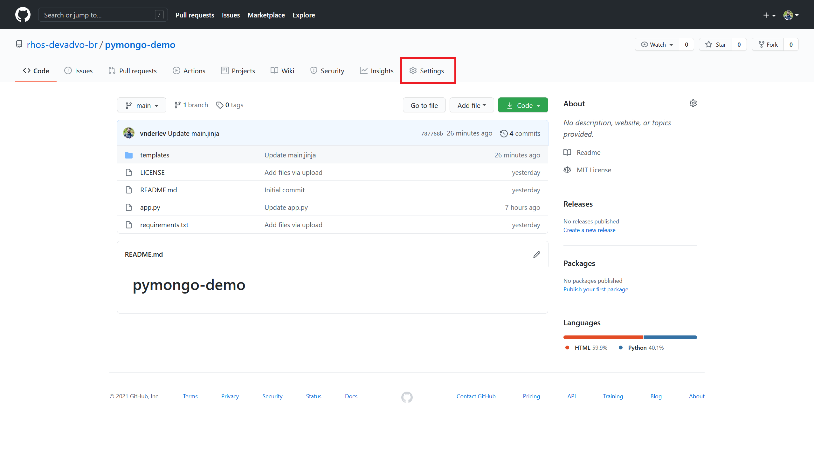
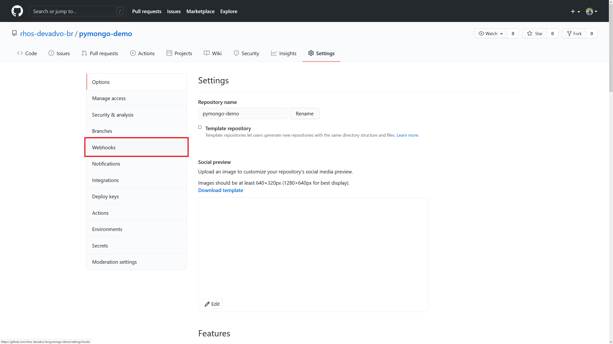
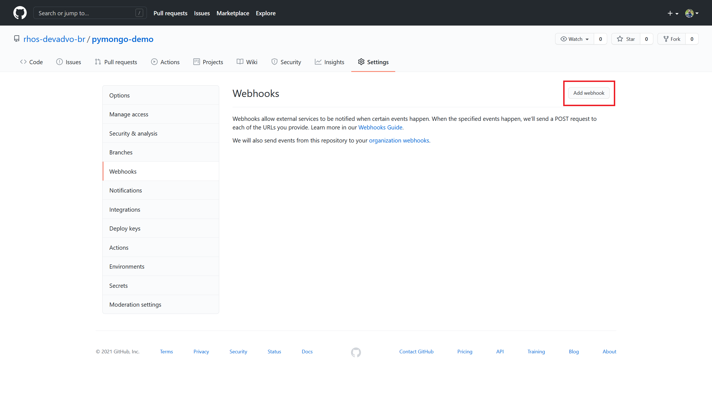
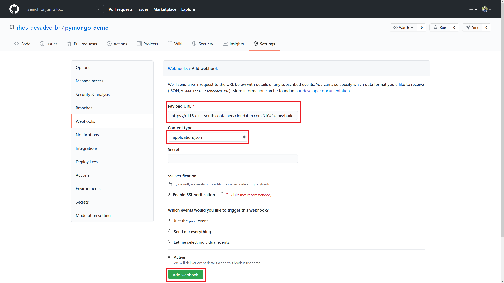
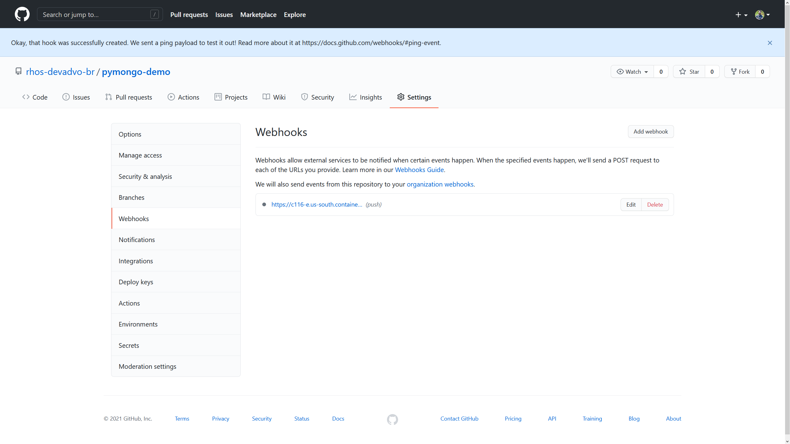

 

    

 
 
 

# LAB 3: DevOps with OpenShift source-to-image (s2i) and GitHub webhooks

## 1. Introduction

In this lab you'll make use of the GitHub webhook functionality to allow OpenShift to detect commit pushes automatically. These detections will trigger the build of the updated code and then the continuous deployment of the Flask web application built on [LAB 1](./lab-1.md) and [LAB 2](./lab-2.md). This capability is called source-to-image (s2i).

## 2. Configuring the GitHub webhook

Go to the Administrator panel and "Builds -> Build Configs" then click on the "web" BuildConfig created at LAB 1.

 

    

 

You'll see information about the created Deployment, such as the source Git Repository, Build image templates and labels. Scrolling to the end of the page you'll see URLs that can be used to configure webhooks.

 

    

 

Copy the GitHub webhook URL and navigate to the GitHub source repository settings.

 

    

 

Click at the "Webhooks" tab on the left-side panel.

 

    

 

Then at the top-right corner click on "Add webhook".

 

    

 

Paste the webhook URL at the "Payload URL" field, select "application/json" in the "Content type" drop-down menu and then click on the green "Add webhook" button.

 

    

 

GitHub should display a light-blue message on the top of the page saying that the webhook was successfully configured, as shown in the picture below.

 

    

 

## 3. Pushing a new commit to the repository

After the webhook configuration is done you can edit any part of the code and OpenShift will automatically start building the updated version of the application as soon as the commit is pushed to the source repository.

Note: if your GitHub repository is private, you'll need to configure a SourceSecret at your GitHub project. This can be done in the application creation form at the "Advanced github options" tab.

[Go to LAB 2: Scaling pods and adding a self-healing database layer with a Template](./lab-2.md)

[Go to LAB 4: --- ](./lab-4.md)