<br>
<div align="center">
    <a href="../README.md">
        
    </a>
</div>
<br>
<br>
<br>

# LAB 5: The Canary and Blue-Green release approaches

## 1. Introduction

In this lab you'll learn how to release applications following the Blue-Green and Canary approaches.

## 2. Release strategies

A very popular release strategy focusing on risk reduction is called Blue-Green deployment. From [Wikipedia](https://en.wikipedia.org/wiki/User:Nuqing/Blue-green_deployment):

```
Blue-green deployment is a release strategy that can be utilized by
developers for deploying software in a production environment. Blue can
be one particular production environment whereas green can define an
identical production environment. Under blue-green deployment strategy,
software developers are able to minimize downtime and reduce risk by easily swapping environments.
```

This strategy can be easily implemented in OpenShift with the use of annotated Routes.

Another approach usually called "Canary Deployment" is based on directing only a small part of the total requests to an updated version of the application, reducing the number of affected end-users in the case of an undetected production error.

## 3. Creating a new Project for Blue-Green deployment

Use the CLI or the Web Console to create a new Project named "blue-green".

```bash
oc new-project blue-green
```

After creating a new Project, fork the [blue-green-demo](https://github.com/rhos-devadvo-br/blue-green-demo) application from GitHub and proceed to create a new Application "From Dockerfile" with the Web Console.

## 4. Creating the "Blue" deployment

<br>
<div align="center">
    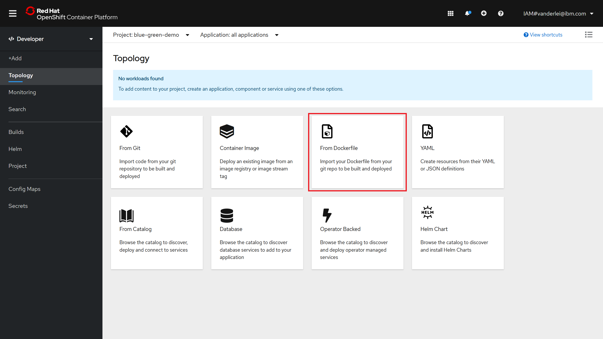
</div>
<br>

In the following application creation form, make sure to fill the Git Repo URL for your forked repository (note that GitHub now uses "main" as the default branch name instead of master - the branch name needs to be set on the "Git Reference" field).

The sample application also uses the **port 5000** instead of the usual 8080. Make sure to set the correct "Container Port" in the form.

<br>
<div align="center">
    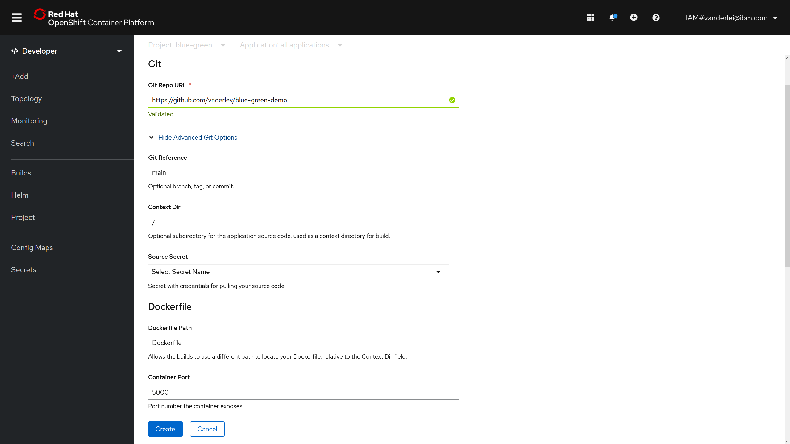
</div>
<br>

The last fields must be exactly like the following image.

- Application Name: "blue-1-app"
- Name: "blue-1"
- Resource type to generate: "Deployment"
- Create a route to the application: TRUE/checked.

After setting the info above, click on "Build Configuration", indicated by the red arrow in the following picture.

<br>
<div align="center">
    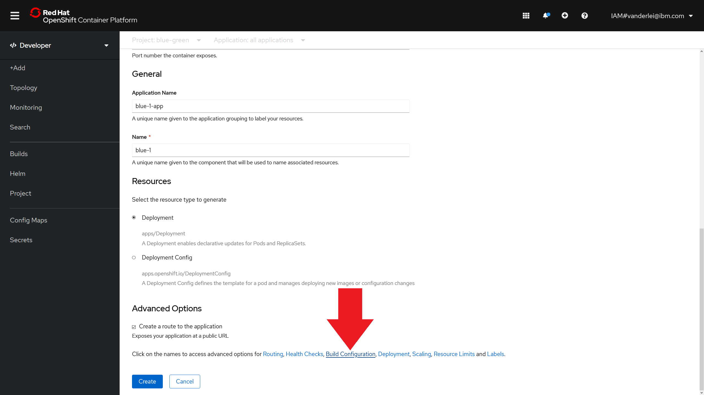
</div>
<br>

A new set of options will appear, where you'll be able to set environment variables for the application pods. Create a variable named "COLOR" with the value "blue, as shown below.

<br>
<div align="center">
    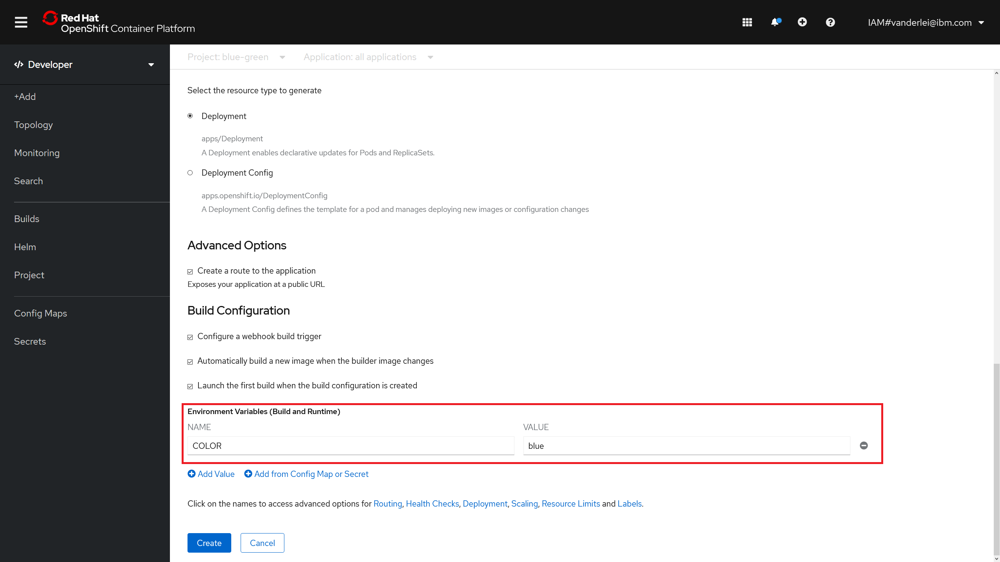
</div>
<br>

Click on Create and wait the Build process. After the build is complete, you can access the web application through the generated Route. To check the app URL, use the get routes command or navigate to the Routes tab in the OpenShift Web Console.

```bash
╭─vnderlev@AMD3900XT ~/openshift 
╰─$ oc get routes            
NAME     HOST/PORT                                                                                                   PATH   SERVICES   PORT       TERMINATION   WILDCARD
blue-1   blue-1-blue-green.vnderlev-roks-162e406f043e20da9b0ef0731954a894-0000.us-south.containers.appdomain.cloud          blue-1     5000-tcp                 None
```

The Blue version of the application should be now accessible through the Internet.

<br>
<div align="center">
    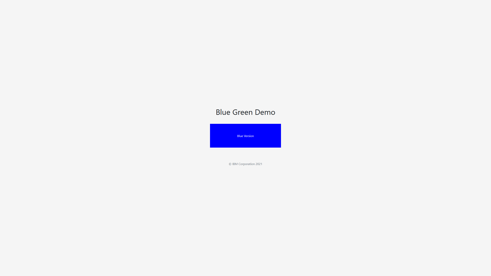
</div>
<br>


## 5. Creating the "Green" deployment

For the green deployment, the same process is repeated, but setting the COLOR=green environment variable instead. Go back to the Topology Canvas, right-click the white background and select "Add to Project -> From Dockerfile".

<br>
<div align="center">
    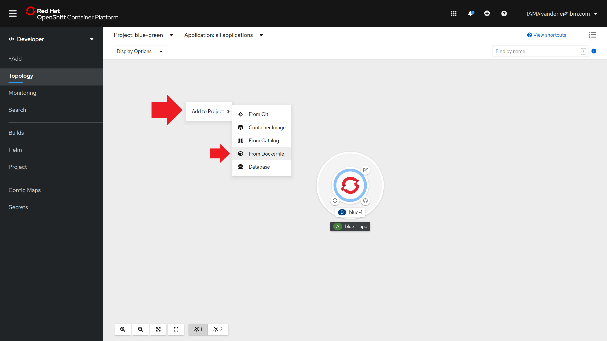
</div>
<br>

Repeat the same values from the Blue deployment for the Git Repo URL, Git Reference and Container Port. At the "General" section of the formulary, click on the "Application" drop-down menu and select "Create Application".

<br>
<div align="center">
    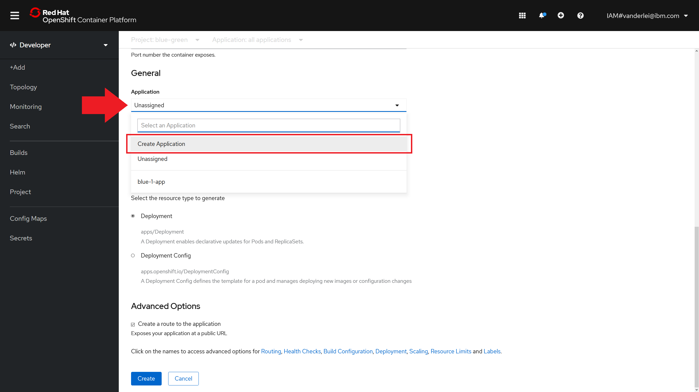
</div>
<br>

The next steps are exactly like the ones from the Blue deployment, but instead the field "Application Name" should be "green-1-app" and "Name" should be "green-1". The COLOR environment variable naturally should be named "green". After clicking on "Create" you'll be redirected back to the Topology Canvas where it will be possible to view the Blue and Green deployments.

<br>
<div align="center">
    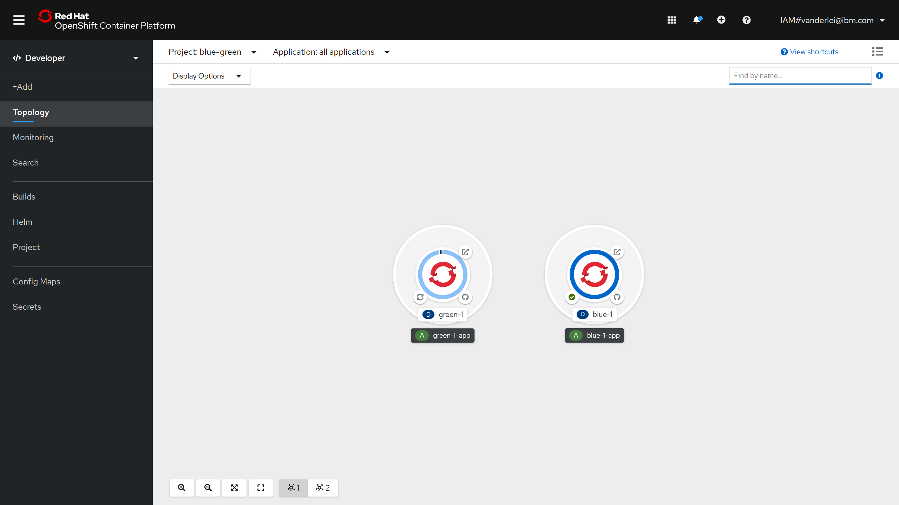
</div>
<br>

After the build process is completed, you should also be able to view the final application, this time displaying the Green rectangle.

<br>
<div align="center">
    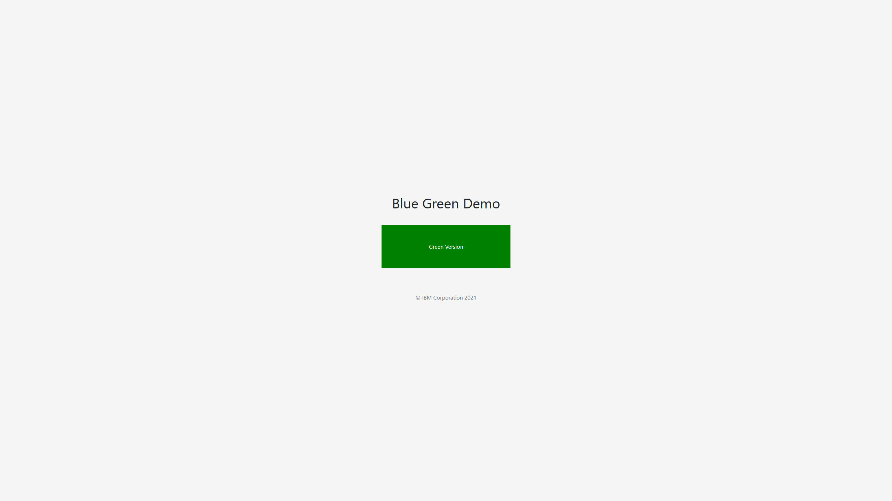
</div>
<br>

## 6. Creating a public Route for multiple services

Go now to the "Networking -> Routes" tab at the Administrator panel in the OpenShift Web Console and click on the top-right button "Create Route"

<br>
<div align="center">
    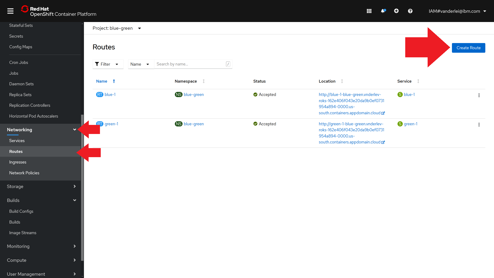
</div>
<br>

At the Route creation formulary, set the following:

1. Name: "public-route".
2. Hostname: leave blank.
3. Path: leave "/".
4. Service: "blue-1" or "green-1", with Weight 100.
5. Alternate Service Target: the unselected service from item 4, with Weight 100 also.
6. Target Port: 5000 -> 5000 (TCP).
7. Secure Route: left the checkbox unchecked.

<br>
<div align="center">
    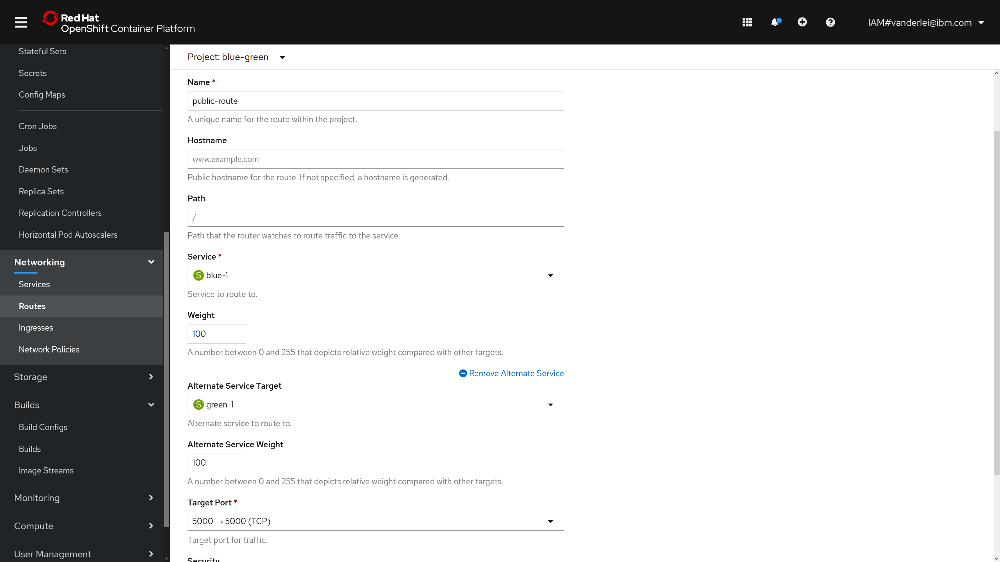
</div>
<br>

After clicking on Create, you'll be redirected to the Route details. Access the application from the browser and verify if it's working. Because the OpenShift routes have sticky sessions with the use of cookies, this needs to be disabled for "true" round-robin.

## 7. Disabling sticky-sessions and enabling round-robin load balancing

To disable sticky sessions and setup round-robin load balancing, execute the following commands:

```bash
oc annotate route/public-route haproxy.router.openshift.io/balance=roundrobin
```

```bash
oc annotate route/public-route haproxy.router.openshift.io/disable_cookies=true
```

After these two commands are executed, each time you access the public route one of the deployments will be displayed.

<hr>

[Go to LAB 4: DevOps with Tekton Pipelines](./lab-4.md)

[Go to LAB 6: --](./lab-6.md)