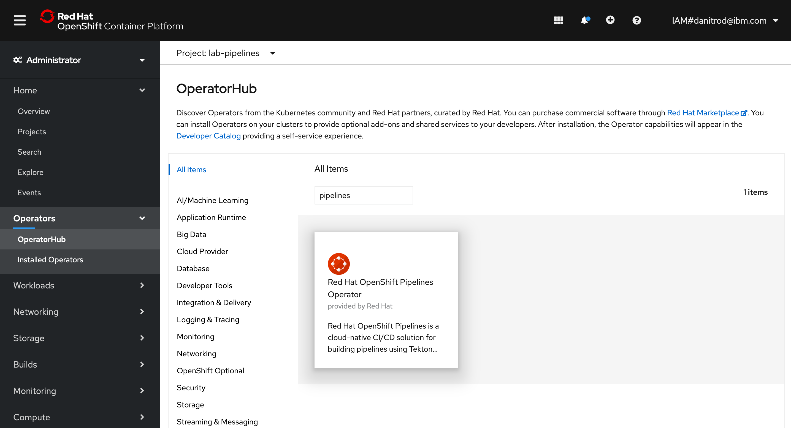
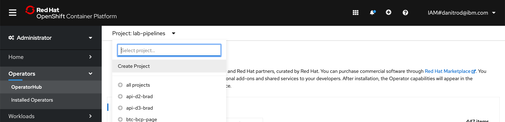

<br>
<div align="center">
    <a href="../README.md">
        
    </a>
</div>
<br>
<br>
<br>

# LAB 5: OpenShift Pipelines

## 1. Introduction

Now that you are able to deploy an app and track an existing git repository, maybe you want to start doing something in between the commit events and the deployment. That’s where pipelines comes in. Pipelines are a sequence of automated actions that can be executed when a specific event triggers. The actions can consist of executing code tests, production builds, deployments, or custom functions. In this lab, we are going to develop a pipeline with OpenShift Pipelines, a fully cloud native solution for building pipelines using [Tekton](https://tekton.dev), an open source Kubernetes native pipeline CI/CD framework.

## 2. Setup

### 2.1. Installing the Pipelines Operator

- [Via web console](#via-console)
- [Via terminal](#via-terminal)

#### Via console

On your OpenShift console, navigate to the `OperatorHub` and search for `Red Hat OpenShift Pipelines Operator`. Select the operator and install it with the default configurations.



You can see the installation progress under the `Installed Operators` tab.


#### Via terminal

To install via terminal you will have to create a subscription YAML file, which specifies that you want to subscribe to the OpenShift Pipelines operator. The file should look like this:

`subscription.yaml`

```
apiVersion: operators.coreos.com/v1alpha1
kind: Subscription
metadata:
  name: openshift-pipelines-operator
  namespace: openshift-operators
spec:
  channel: openshift-operators
  name: openshift-pipelines-operator-rh
  source: redhat-operators
  sourceNamespace: openshift-marketplace
```

With the file created, you can apply it to the cluster with the following command:

```
oc apply -f subscription.yaml
```

You can then check if it was installed successfully executing:

```
oc api-resources --api-group=tekton.dev
```

_All Tekton resources are installed under the tekton.dev API group_

### 2.2. Installing the Tekton CLI tool

[Install the Tekton CLI tool here](https://tekton.dev/docs/getting-started/#set-up-the-cli). It will be needed later in the lab.

### 2.3. Create a new project

Create a new project on your OpenShift console to work on this lab. We will call it `lab-pipelines`.

#### Via web console



#### Via terminal

```
oc new-project lab-pipelines
```

## 3. Developing a pipeline

To create a Tekton pipeline we will use the following concepts:

- `Task`: consists of a number of steps that run to complete a determined task. Can be ran alone, or even be reusable across pipelines. Receives input parameters each run.
- `Pipeline`: one or more tasks grouped together to run sequentially. Is often triggered by an event.
- `TaskRun`: an instance of an executed task with specific parameters.
- `PipelineRun`: an instance of an executed pipeline with specific parameters.

Let's create a pipeline for our app. The app is a Rust web server that displays a simple page and has tests configured. The pipeline will test, build and deploy the app, and we will configure a trigger for the event of `push` in a git repository, so we can assure every update will be tested and deployed. If you want to configure the webhook, you will have to [fork the repository](https://github.com/rhos-devadvo-br/blue-green-demo) and use your repository URL when running the pipeline.

### 3.1. Creating tasks

Some tasks already come configured in a OpenShift, these we call `ClusterTasks`. In our pipeline we will use two of them: the `git-clone` task, which clones a git repository, and the `buildah` task, which builds an image and pushes it to an image registry. The other tasks we will use will have to be created.

The first task we will create is `test-app`, which will simply execute the `cargo test` command to test our Rust app. [The yaml file for it can be found here](./resources/lab-6/tasks/test-app.yml). Note that each task can run in its own image, and in this one we are using a Rust image.

The second task is the `apply-manifests` task, which will apply the manifest files, such as `deployment.yml` and `service.yml`, found in our app repository. [The yaml file for it can be found here](./resources/lab-6/tasks/apply-manifests.yml). It receives as parameter `manifest_dir`, the directory where the manifest files are located, which is by default `k8s`.

And the third task is `update-deployment`, which will patch a deployment with our newly created image. [The yaml file for it can be found here](./resources/lab-6/tasks/update-deployment.yml). It receives as parameters `deployment`, the name of the deployment, and `IMAGE`, the name of the image to deploy.

You can create the three tasks in your cluster with one command:

```
oc create -f https://github.com/rhos-devadvo-br/ibmcloud-ocp-101/tree/main/labs/resources/lab-6/tasks
```

### 3.2. Creating a PVC

Our pipeline execution will need to store resources such as the repository source code and the dependencies for testing. Therefore, we will need to create a Persistent Volume Claim (PVC) to associate our pipeline to.

You can create it with:

```
oc create -f https://github.com/rhos-devadvo-br/ibmcloud-ocp-101/tree/main/labs/resources/lab-6/tekton-pvc.yml
```

### 3.3. Creating the pipeline

Now that we have setup our tasks, we can finally create our pipeline. We will name it `test-build-deploy`, and it will run 5 tasks, in the following order:

1. `fetch-repository` (`git-clone` ClusterTask);
2. `test-app` (custom task);
3. `build-image` (`buildah` ClusterTask);
4. `apply-manifests` (custom task); and
5. `update-deployment` (custom task).

[The yaml file for the pipeline can be found here](./resources/lab-6/pipelines/pipeline.yml). We define each task parameter as a parameter for the pipeline as well:

- `deployment-name`: for `update-deployment`
- `git-url`: for `fetch-repository`
- `git-revision`: for `fetch-repository`
- `IMAGE`: for `build-image` and `update-deployment`

Note that we will not need the `manifest_dir` parameter for the `apply-manifests` task as we will be using the default `k8s` directory.

Create the pipeline:

```
oc create -f https://github.com/rhos-devadvo-br/ibmcloud-ocp-101/tree/main/labs/resources/lab-6/pipeline
```

Now, our pipeline is ready to be runned. We will first run it manually, then we will create a trigger for running it whenever the git repository updates.

## 4. Running a pipeline

### 4.1. Running manually

You can run manually a pipeline using the [Tekton CLI](https://tekton.dev/docs/getting-started/#set-up-the-cli):

```
tkn pipeline start test-build-deploy -w name=shared-workspace,claimName=tekton-pvc -p deployment-name=pipelines-demo -p git-url=https://github.com/rhos-devadvo-br/pipelines-demo.git -p IMAGE=image-registry.openshift-image-registry.svc:5000/lab-pipelines/pipelines-demo --showlog
```

_If you forked the repository, be sure to change the git URL above to your repository._

Note that we pass each pipeline parameter with the `-p` option, and we specify that the pipeline will use a workspace named `shared-workspace`, which uses the `tekton-pvc` PVC that we created previously.

You can now follow along the logs as the pipeline executes. Once it ends, the app will be already deployed and you can access it. To get its route, run:

```
oc get route pipelines-demo --template='http://{{.spec.host}}
```

You can also check the `PipelineRun` and its logs out on the OpenShift web console, under the `Pipelines`>`Pipeline Runs` section.

### 4.2. Creating a trigger for the pipeline

To create a [Tekton trigger](https://tekton.dev/docs/triggers/), we will need the following resources:

- `PipelineTemplate`: specifies how the PipelineRun will execute, receiving some parameters from the trigger action, and configuring how each pipeline parameter will be set;
- `TriggerBinding`: will link an event to a `PipelineTemplate`, passing the parameters received from the event through;
- `Trigger`: references to which `PipelineTemplate` the `TriggerBinding` is linked;
- `EventListener`: will run a pod that stays listening for events and triggers a determined `Trigger` when the event occurs.

In our case, the event we will listen to is a GitHub webhook that triggers on a `push`, and we will use the name of the repository and the git revision, [which come from the event](https://docs.github.com/en/developers/webhooks-and-events/webhook-events-and-payloads#push), as parameters to the pipeline. The resources we will use [can be found here](./resources/lab-6/trigger), and you can create them with:

```
oc create -f https://github.com/rhos-devadvo-br/ibmcloud-ocp-101/tree/main/labs/resources/lab-6/trigger
```

After creating, a pod will start running in your project, which will already be listening for events. you can check that running `oc get pods`.

You will have to expose the pod so it can listen to public events:

```
oc expose svc el-event-listener
```

To get the URL for the event listener you can run:

```
oc  get route el-event-listener --template='http://{{.spec.host}}
```

And now we only need to create a GitHub webhook for this URL. If you don't remember the steps, you can check them again in [lab 3](./lab-3.md).

After creating the webhook, a new `PipelineRun` is instantly created. You can check that in the `Pipelines`>`Pipeline Runs` section of OpenShift web console, or execute `tkn pipelinerun list` to see it. Then you can check the logs with `tkn pipelinerun logs <your-pipeline-name>`.

### 5. Wrapping up

With that, you now know how to work with Tekton pipelines on OpenShift, and you are ready to build robust CI/CD for your applications. In the next lab, we will look into a common approach for safely deploying your applications.

## Additional resources

getting webhook - https://docs.openshift.com/container-platform/4.6/pipelines/creating-applications-with-cicd-pipelines.html#adding-triggers_creating-applications-with-cicd-pipelines

- Red Hat OpenShift docs: https://docs.openshift.com/container-platform/4.6/
- Interactive OpenShift Pipelines lab: https://learn.openshift.com/middleware/pipelines/

<hr>

[Go to LAB 4: Devops with Classic Pipelines](./lab-4.md)

[Go to LAB 6: The Canary and Blue-Green release approaches](./lab-6.md)

```

```
